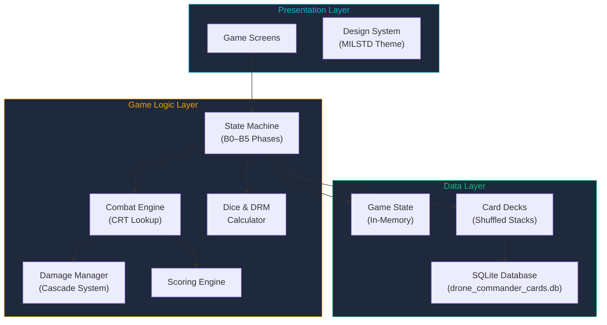
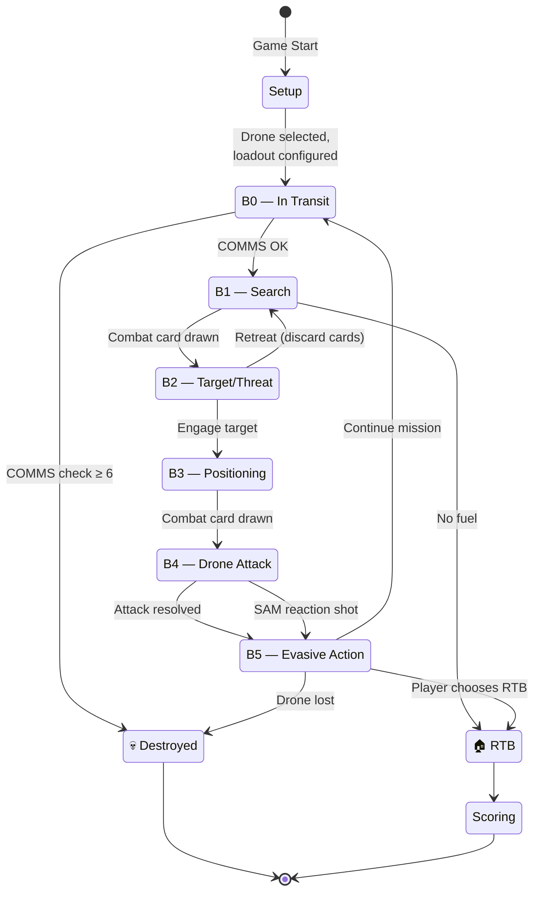
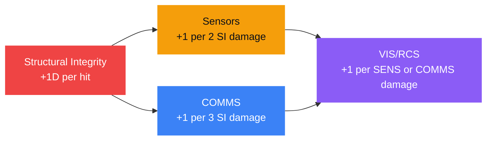
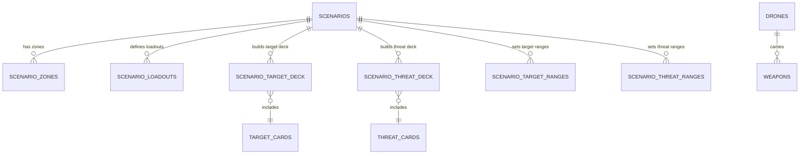

# OB3 — Drone Commander Mobile: Architecture

> System design, game loop state machine, database schema, and data flow for the Drone Commander mobile game.

---

## System Overview



The application follows a three-layer architecture:

| Layer | Responsibility |
|-------|---------------|
| **Presentation** | Game screens, UI components, animations, MILSTD theme |
| **Game Logic** | State machine, combat resolution, dice rolling, damage, scoring |
| **Data** | SQLite database access, in-memory game state, card deck management |

---

## Game Loop State Machine

The game's core mechanic is a looping state machine through six phases (B0–B5). Each cycle represents one complete mission pass.



### Phase Details

#### B0 — In Transit

- **First turn:** Set altitude to MEDIUM (starting altitude per functional spec)
- **Returning from B5:** If COMMS Damage > 2, roll 1D6 for controllability check
  - ≤2 → All OK
  - 3–5 → Controllable with difficulty (−1 Attack DRM)
  - ≥6 → **Uncontrollable — drone destroyed, game ends**
- **DRM modifiers for COMMS check:** −1 each for SATCOM, Comms Redundancy, Autonomous AI

#### B1 — Search

- **Optional:** Change altitude (costs 2F UP / 1F DOWN per level)
- **Required:** Option to resolve any target/threat cards (not a full mechanics phase, rules ambiguous) // TODO cleanup based on spec
- If fuel = 0 after card resolution → forced RTB

#### B2 — Target Acquisition / Threat Determination

- **Required:** Spend 1F
- **Target Acquisition:** Roll 2D10, apply DRM, consult Target Acquisition Table → draw matching target card
- **Threat Determination:** Roll 2D10, apply DRM, consult Threat Determination Table → draw matching threat card
- **Commander's Decision:** Engage (→ B3) or retreat (discard both cards → B1)

#### B3 — Positioning

- **Optional:** Change altitude (costs 2F UP / 1F DOWN per level)
- **Required:** Draw a combat card and execute its instructions

#### B4 — Drone Attack

1. Select attack mode: Stand-Off, Close-In, or FO/Laze
2. Select weapon (must be compatible with target type and attack mode)
3. Select attack altitude (VLOW / LOW / MEDIUM / HIGH)
4. Roll 1D6 + all DRM modifiers
5. Consult Drone Attack CRT → HIT or miss
6. Apply column shifts (Sensor Damage: shift 1 RIGHT per 2 points)
7. Consume fuel per CRT cell; remove used weapon
8. **SAM targets only (optional rule):** If missed, SAM gets a reaction shot

#### B5 — Evasive Action

1. Roll 1D6 + DRM modifiers
2. Consult Counterfire & Evasion CRT → damage and fuel cost
3. Apply damage cascade (see [Damage System](#damage-cascade-system))
4. If drone destroyed → game ends
5. **Commander's Decision:** Continue (→ B0), RTB, or pitstop (campaign only)

---

## Damage Cascade System

Damage flows through a cascading chain. Structural damage causes sensor and COMMS damage, which in turn increase visibility:



| Indicator | Starts At | Max | Effect |
|-----------|-----------|-----|--------|
| **Structural Integrity** | Drone max SI | 0 (Destroyed) | 0 → drone destroyed |
| **Sensors** | 0 | 9 | Every 4 points → −1 Attack DRM |
| **COMMS** | 0 | 5 | > 2 → COMMS check at B0 each turn |
| **VIS/RCS** | 0 (base) | — | Higher → enemy finds you easier (+10 Threat DRM per 2 VIS) |
| **Fuel** | Drone endurance | 0 | 0 → forced RTB. Depleted at END of cycle only |

---

## Database Schema

The `drone_commander_cards.db` SQLite database contains 12 tables. The relationships are:



### Core Game Tables

| Table | Rows | Key Fields |
|-------|------|-----------|
| `drones` | 28 | `name`, `country`, `category`, `class` (A–D), `altitude`, loadout options, `has_aeasa_radar`, `has_satcom`, `has_autonomous_ai`, `max_structural_integrity`, `description` |
| `weapons` | 28 | `type`, `name`, `targets` (compatible types), `range`, `altitude`, DRM per target type |
| `combat_cards` | 18 | `card_number`, `type`, `name`, `instructions`, `image` |
| `target_cards` | 111 | `card_number`, `type`, `sub_category`, `name`, `VP`, `altitude_restriction`, `weapon_type` |
| `threat_cards` | 36 | `card_number`, `type`, `sub_category`, `name`, `altitude_restriction`, `column_shift` |

### Scenario Tables

| Table | Key Fields |
|-------|-----------|
| `scenarios` | `name`, `campaign`, `description`, `objectives`, `scoring_mode`, card counts |
| `scenario_zones` | `zone_number`, `star_marking`, `terrain` |
| `scenario_loadouts` | loadout options per scenario |
| `scenario_target_deck` | target card composition per zone |
| `scenario_threat_deck` | threat card composition per zone |
| `scenario_target_ranges` | target probability ranges per zone |
| `scenario_threat_ranges` | threat probability ranges per zone |

---

## Data Models

### Drone

```
Drone {
  id: int
  name: String              // e.g. "MQ-9 Reaper", "TB2 Bayraktar"
  country: String
  category: String
  class: Enum(A, B, C, D)   // A=Heavy, B=Medium, C=Small, D=Micro
  altitude: List<Enum>      // Supported altitudes: VLOW, LOW, MEDIUM, HIGH
  fuel: int                 // Endurance in hours (source of starting fuel)
  max_structural_integrity: int
  has_aeasa_radar: bool     // +10 Target Acquisition DRM
  has_satcom: bool          // −1 COMMS check DRM
  has_autonomous_ai: bool   // −1 COMMS check DRM
  loadout_options: List<LoadoutOption>
}
```

### Game State

```
GameState {
  drone: Drone
  current_phase: Enum(B0, B1, B2, B3, B4, B5)
  current_altitude: Enum(VLOW, LOW, MEDIUM, HIGH)
  attack_mode: Enum(STANDOFF, CLOSE_IN, FO_LAZE)

  // Health indicators
  structural_integrity: int   // starts at drone.max_structural_integrity
  sensors_damage: int         // starts 0, max 9
  comms_damage: int           // starts 0, max 5
  vis_rcs: int                // starts at default based on drone
  fuel: int                   // starts at drone.fuel (endurance)

  // Deck state
  loadout: List<Weapon>       // remaining weapons
  target_deck: Stack<TargetCard>
  threat_deck: Stack<ThreatCard>
  combat_deck: Stack<CombatCard>
  discard_pile: List<Card>
  destroyed_targets: List<TargetCard>  // VP source

  // Current encounter
  active_target: TargetCard?
  active_threat: ThreatCard?
  active_combat_card: CombatCard?

  // Scoring
  total_vp: int
  turn_count: int
}
```

---

## Combat Resolution Tables (CRT)

The game uses three CRT tables, each indexed by **attack mode** × **altitude** × **DRM column**:

### Drone Attack Table

Result format: fuel cost + optional HIT. Column shifts: +1 RIGHT per 2 points of Sensor Damage.

| Altitude | Stand-Off (DRM 1–6) | Close-In (DRM 1–6) | FO/Laze (DRM 1–6) |
|----------|---------------------|---------------------|--------------------|
| HIGH | 1F…1F+HIT | 2F…2F+HIT | 3F…3F+HIT |
| MEDIUM | 1F…1F+HIT | 2F…2F+HIT | 3F…3F+HIT |
| LOW | 1F (no HIT) | 2F…2F+HIT | 3F…3F+HIT |

> Higher DRM = better chance of HIT. Higher altitude favors Stand-Off; lower altitude favors Close-In/FO.

### Counterfire & Evasion Table

Result format: damage + fuel cost. Column shifts: −1 LEFT per 2 points of VIS/RCS.

| Altitude | Stand-Off (DRM 1–6) | Close-In (DRM 1–6) | FO/Laze (DRM 1–6) |
|----------|---------------------|---------------------|--------------------|
| HIGH | —…1D+2F | —…1D+1F | —…1D+1F |
| MEDIUM | —…1D+1F | —…2D+F | —…1D+1F |
| LOW | — | — | 2D+F…1D+1F |

### SAM Special Counterfire Table

Applies only when attacking a SAM target and missing. Same column shift rules.

---

## Scoring

Two scoring methods, selected per scenario:

| Method | When Game Ends | Calculation |
|--------|---------------|-------------|
| **Maximum Kill** | All target cards drawn from deck | Sum VP from destroyed targets |
| **Quick Kill** | Primary objective completed | Sum VP from destroyed targets |

Final score = sum of VP from the **Destroyed Target pile**.

---

## Altitude Levels

The game supports 4 altitude levels (extended from the original 3):

| Level | Notes |
|-------|-------|
| **VLOW** | Added for mobile adaptation; affects CRT results |
| **LOW** | Stand-Off attacks cannot HIT at this altitude |
| **MEDIUM** | Balanced risk/reward |
| **HIGH** | Starting altitude; best Stand-Off hit chance |

> [!WARNING]
> **DILEK Clearance Item #3**: VLOW altitude row must be added to ALL CRT tables (Attack, Counterfire, SAM). Values not yet defined.

---

## Open Issues (DILEK Clearance Required)

These items are flagged from the rulebook Q&A and must be resolved before implementation:

| # | Issue | Impact |
|---|-------|--------|
| 1 | **Counterfire table LOW row (Stand-Off & Close-In)** — all cells empty, likely incorrect | Combat balance at LOW altitude |
| 2 | **SAM Counterfire table LOW row** — all cells empty, some SAMs should hit at LOW | SAM mechanic accuracy |
| 3 | **VLOW altitude row** — needs to be added to all CRT tables | CRT table completeness |
| 4 | **Endurance/fuel data** — `endurance_hours` column missing from `drones` table | Drone fuel initialization |

---

*Architecture version: 0.1.0 — Phase 0 (Foundation)*
*Last updated: 2026-03-10*
