# Drone Commander — Game Loop Diagram

```mermaid
flowchart TD
    START(["🎮 GAME START"]) --> SETUP["⚙️ SETUP\nSelect drone & loadout\nSet fuel/sensors/VIS to starting values\nShuffle & place card decks"]
    SETUP --> B0

    subgraph TURN ["ONE GAME TURN"]
        B0["📡 B0 — IN TRANSIT"]
        B1["🔍 B1 — SEARCH"]
        B2["🎯 B2 — TARGET ACQ / THREAT DET"]
        B3["📐 B3 — POSITIONING"]
        B4["💥 B4 — DRONE ATTACK"]
        B5["🛡️ B5 — EVASIVE ACTION"]
    end

    B0 --> |"First turn: set HIGH altitude"| B0_CHECK
    B0_CHECK{"COMMS Damage > 2?"}
    B0_CHECK --> |"No"| B1
    B0_CHECK --> |"Yes"| COMMS_CHECK{"Roll 1D6\nCOMMS Check"}
    COMMS_CHECK --> |"≤2: All OK"| B1
    COMMS_CHECK --> |"3-5: Degraded\n-1 Attack DRM"| B1
    COMMS_CHECK --> |"≥6: Uncontrollable"| DESTROYED

    B1 --> |"Optional: Change altitude (-1F)\nRequired: Draw combat card"| B1_FUEL{"Fuel remaining?"}
    B1_FUEL --> |"Yes"| B2
    B1_FUEL --> |"No"| RTB

    B2 --> |"-1F fuel cost"| B2_DETECT["Roll 2D10 → Target Acq Table\nDraw Target Card"]
    B2_DETECT --> B2_THREAT["Roll 2D10 → Threat Det Table\nDraw Threat Card"]
    B2_THREAT --> DECISION1

    DECISION1{"🎯 COMMANDER'S DECISION\nIs target worth the risk?"}
    DECISION1 --> |"❌ No — Discard both cards"| B1
    DECISION1 --> |"✅ Yes — Engage"| B3

    B3 --> |"Optional: Change altitude (-1F)\nRequired: Draw combat card"| B4

    B4 --> SELECT_MODE["Select Attack Mode\n• Stand-Off\n• Close-In\n• FO/Lazing"]
    SELECT_MODE --> SELECT_WPN["Select Weapon\nSelect Altitude"]
    SELECT_WPN --> ATTACK_ROLL["Roll 1D6 + DRM modifiers"]
    ATTACK_ROLL --> ATTACK_CRT{"Consult ATTACK CRT\nAltitude × DRM × Mode"}
    ATTACK_CRT --> |"HIT + Fuel cost"| TARGET_DESTROYED["✅ Target Destroyed\n→ Destroyed pile\nAdd VP"]
    ATTACK_CRT --> |"Miss + Fuel cost"| TARGET_MISS["❌ Target Missed\n→ Discard pile"]
    TARGET_DESTROYED --> SAM_CHECK
    TARGET_MISS --> SAM_CHECK

    SAM_CHECK{"Was target a SAM?\nAnd missed?"}
    SAM_CHECK --> |"No"| B5
    SAM_CHECK --> |"Yes: Roll 1D6 + VIS"| SAM_REACT{"SAM Reaction\nFinal DRM ≥ 6?"}
    SAM_REACT --> |"No reaction"| B5
    SAM_REACT --> |"SAM fires back!\nConsult SAM CRT"| SAM_DAMAGE["Apply SAM damage"]
    SAM_DAMAGE --> SURVIVE_SAM{"Drone survives?"}
    SURVIVE_SAM --> |"Yes"| B5
    SURVIVE_SAM --> |"No"| DESTROYED

    B5 --> EVASION_ROLL["Roll 1D6 + DRM modifiers"]
    EVASION_ROLL --> EVASION_CRT{"Consult EVASION CRT\nAltitude × DRM × Mode"}
    EVASION_CRT --> |"No damage, fuel cost"| SURVIVE
    EVASION_CRT --> |"Damage + fuel cost"| TAKE_DMG

    TAKE_DMG["📊 TAKE DAMAGE\n• Structural Integrity +D\n• Sensors +1 per 2 SI dmg\n• COMMS +1 per 3 SI dmg\n• VIS +1 per COMMS/Sensor dmg"]
    TAKE_DMG --> SURVIVE_CHECK{"Drone intact?\nSI < Max DP?"}
    SURVIVE_CHECK --> |"No"| DESTROYED
    SURVIVE_CHECK --> |"Yes"| SURVIVE

    SURVIVE --> DECISION2

    DECISION2{"🎯 COMMANDER'S DECISION\nWhat next?"}
    DECISION2 --> |"Continue: Has fuel & ammo"| B0
    DECISION2 --> |"Return to base"| RTB
    DECISION2 --> |"Campaign: Pitstop for repairs"| RTB

    %% End conditions
    DESTROYED(["💀 DRONE DESTROYED\nGAME OVER"])
    RTB(["🏠 RETURN TO BASE"])
    NO_TARGETS(["📭 ALL TARGETS EXPANDED"])

    RTB --> SCORING
    NO_TARGETS --> SCORING
    SCORING["🏆 SCORING\nSum VP from Destroyed Target pile"]
    SCORING --> GAME_END(["🎮 GAME END"])

    %% Target deck check (happens implicitly)
    B2_DETECT -.-> |"No target cards left"| NO_TARGETS

    %% Styling
    style START fill:#06b6d4,color:#0a0e17,stroke:none
    style GAME_END fill:#06b6d4,color:#0a0e17,stroke:none
    style DESTROYED fill:#ef4444,color:#fff,stroke:none
    style RTB fill:#f59e0b,color:#0a0e17,stroke:none
    style NO_TARGETS fill:#10b981,color:#0a0e17,stroke:none
    style SCORING fill:#8b5cf6,color:#fff,stroke:none
    style DECISION1 fill:#1e293b,color:#f59e0b,stroke:#f59e0b
    style DECISION2 fill:#1e293b,color:#f59e0b,stroke:#f59e0b
    style B0 fill:#111827,color:#06b6d4,stroke:#06b6d4
    style B1 fill:#111827,color:#3b82f6,stroke:#3b82f6
    style B2 fill:#111827,color:#8b5cf6,stroke:#8b5cf6
    style B3 fill:#111827,color:#ec4899,stroke:#ec4899
    style B4 fill:#111827,color:#ef4444,stroke:#ef4444
    style B5 fill:#111827,color:#f97316,stroke:#f97316
```

### Key Decision Points

| Point | Location | Player Chooses |
|-------|----------|----------------|
| **Altitude change** | B1, B3 | Spend 1F to go higher/lower |
| **Engage or retreat** | B2 | Risk assessment: is target VP worth the threat? |
| **Attack mode** | B4 | Stand-Off (safe, low hit), Close-In (risky, high hit), FO/Laze (variable) |
| **Weapon selection** | B4 | Which loadout to spend (type must match target) |
| **Attack altitude** | B4 | LOW/MED/HIGH affects hit and evasion chances |
| **Continue or RTB** | B5 | Keep looping (burn fuel) or bank your score |

### Game-Ending Conditions

| Condition | Trigger | Result |
|-----------|---------|--------|
| 💀 **Destroyed** | SI damage ≥ drone max DP | Immediate loss |
| 💀 **Uncontrollable** | COMMS check ≥ 6 at B0 | Immediate loss |
| ⛽ **No fuel** | Can't move to next box | Forced RTB |
| 📭 **Targets exhausted** | All target cards drawn | Mission complete → score |
| 🏠 **Voluntary RTB** | Player decides at B5 | Mission ends → score |
