# Drone Commander — Game Loop Diagram

```mermaid
flowchart TD
    START(["🎮 GAME START"]) --> SETUP["⚙️ SETUP\nSelect drone & loadout\nShuffle 3 decks (Combat/Target/Threat)\nSet height to MEDIUM\nFuel = endurance hours"]
    SETUP --> B0

    subgraph CYCLE ["ONE GAME CYCLE"]
        B0["📡 B0 — IN TRANSIT"]
        B1["🔍 B1 — SEARCH"]
        B2["🎯 B2 — TARGET ACQ / THREAT DET"]
        B3["📐 B3 — POSITIONING"]
        B4["💥 B4 — DRONE ATTACK"]
        B5["🛡️ B5 — EVASIVE ACTION"]
        EOL["🔄 END-OF-LOOP CHECK"]
    end

    B0 --> B0_CHECK{"COMMS Damage > 2?"}
    B0_CHECK --> |"No"| B1
    B0_CHECK --> |"Yes"| COMMS_CHECK{"Roll 1D6\nCOMMS Check"}
    COMMS_CHECK --> |"≤2: All OK"| B1
    COMMS_CHECK --> |"3-5: Degraded\n-1 Attack DRM"| B1
    COMMS_CHECK --> |"≥6: Uncontrollable"| DESTROYED

    B1 --> |"Optional: Change height (free action)\nNo card draws at B1"| B2

    B2 --> |"-1F fuel cost"| B2_CARDS["Draw TARGET CARD\nDraw THREAT CARD"]
    B2_CARDS --> B2_DETECT["Roll 2D10 → Target Acq Table\nRoll 2D10 → Threat Det Table"]
    B2_DETECT --> KILL_CHECK{"Target killed?\n(dice roll displayed)"}
    KILL_CHECK --> |"Hit! Roll: 14 — Hit!"| VP_BANK["✅ VP banked immediately\nKill list updated"]
    KILL_CHECK --> |"Miss"| DECISION1
    VP_BANK --> OBJ_CHECK{"Primary objective\ncomplete?"}
    OBJ_CHECK --> |"No"| DECISION1
    OBJ_CHECK --> |"Yes (shown once)"| OBJ_PROMPT{"RTB or Continue?"}
    OBJ_PROMPT --> |"RTB"| BRIEFING
    OBJ_PROMPT --> |"Continue"| DECISION1

    DECISION1{"🎯 COMMANDER'S DECISION\nIs target worth the risk?"}
    DECISION1 --> |"❌ No — Discard both"| B1
    DECISION1 --> |"✅ Yes — Engage"| B3

    B3 --> |"Optional: Change height\nOptional: Draw COMBAT CARD\n(effects last this cycle only)"| B4

    B4 --> SELECT["Select Height + Mode + Weapon\n• Stand-Off / Close-In / FO-Laze"]
    SELECT --> ATTACK_ROLL["Roll 1D6 + DRM modifiers"]
    ATTACK_ROLL --> ATTACK_CRT{"Consult ATTACK CRT"}
    ATTACK_CRT --> |"HIT"| TARGET_HIT["✅ Target Destroyed\nVP banked immediately"]
    ATTACK_CRT --> |"Miss"| B5
    TARGET_HIT --> SAM_CHECK{"SAM target\nmissed?"}
    SAM_CHECK --> |"No"| B5
    SAM_CHECK --> |"SAM fires back"| SAM_DAMAGE["Apply SAM damage"]
    SAM_DAMAGE --> B5

    B5 --> THREAT_RESOLVE["Resolve THREAT CARD\nEvasion roll 1D6 + DRM"]
    THREAT_RESOLVE --> EVASION_CRT{"Consult EVASION CRT"}
    EVASION_CRT --> |"Evaded"| EOL
    EVASION_CRT --> |"Damage!"| TAKE_DMG

    TAKE_DMG["📊 APPLY DAMAGE\n• dmg = combat card mod × height mod\n• SI +D → Sensors +1/2 SI\n• COMMS +1/3 SI → VIS +1/dmg"]
    TAKE_DMG --> EOL

    EOL --> CHECK1{"1. Drone destroyed?"}
    CHECK1 --> |"Yes (SI=0)"| BRIEFING
    CHECK1 --> |"No"| CHECK2{"2. Fuel exhausted?"}
    CHECK2 --> |"Yes"| BRIEFING
    CHECK2 --> |"No"| CHECK3{"3. Player RTB?"}
    CHECK3 --> |"Yes"| BRIEFING
    CHECK3 --> |"No"| CYCLE_RESET["✅ All clear\n• Deduct fuel (base + height + card mod)\n• Clear combat card modifier\n• Increment cycle counter"]
    CYCLE_RESET --> B0

    BRIEFING["📋 POST-SCENARIO BRIEFING\n• Termination reason\n• Objectives: ACHIEVED/FAILED\n• Kill list\n• VP breakdown\n• Campaign: ADVANCE/LOCKED"]
    DESTROYED(["💀 DRONE DESTROYED"]) --> BRIEFING
    BRIEFING --> GAME_END(["🎮 GAME END"])

    %% Styling
    style START fill:#06b6d4,color:#0a0e17,stroke:none
    style GAME_END fill:#06b6d4,color:#0a0e17,stroke:none
    style DESTROYED fill:#ef4444,color:#fff,stroke:none
    style BRIEFING fill:#8b5cf6,color:#fff,stroke:none
    style DECISION1 fill:#1e293b,color:#f59e0b,stroke:#f59e0b
    style OBJ_PROMPT fill:#1e293b,color:#f59e0b,stroke:#f59e0b
    style B0 fill:#111827,color:#06b6d4,stroke:#06b6d4
    style B1 fill:#111827,color:#3b82f6,stroke:#3b82f6
    style B2 fill:#111827,color:#8b5cf6,stroke:#8b5cf6
    style B3 fill:#111827,color:#ec4899,stroke:#ec4899
    style B4 fill:#111827,color:#ef4444,stroke:#ef4444
    style B5 fill:#111827,color:#f97316,stroke:#f97316
    style EOL fill:#111827,color:#10b981,stroke:#10b981
    style VP_BANK fill:#10b981,color:#fff,stroke:none
    style TARGET_HIT fill:#10b981,color:#fff,stroke:none
```

### Key Decision Points

| Point | Location | Player Chooses |
|-------|----------|----------------|
| **Height change** | Any time (free action) | Spend nothing to change altitude level |
| **Engage or retreat** | B2 | Risk assessment: is target VP worth the threat? |
| **Combat card** | B3 | Optional: draw a combat card for cycle modifiers |
| **Attack mode** | B4 | Stand-Off / Close-In / FO-Laze |
| **Weapon selection** | B4 | Which loadout to spend |
| **Attack height** | B4 | Affects hit%, evasion%, damage multiplier, fuel |
| **Primary complete** | B2 (once) | RTB now or continue for more kills? |
| **Continue or RTB** | End-of-Loop | Keep looping or bank your score |

### Scenario Termination

| # | Condition | Result |
|---|-----------|--------|
| 1 | 💀 **Destroyed** (SI = 0) | Briefing shown. Banked VP retained. |
| 2 | ⛽ **Fuel exhausted** | Briefing shown. Same path as RTB. |
| 3 | 🏠 **Voluntary RTB** | Briefing shown. Campaign advance if primary met. |
