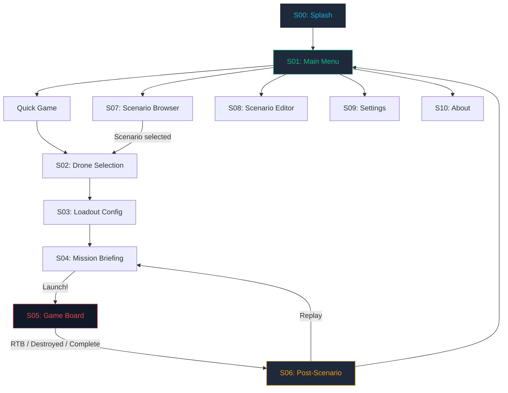
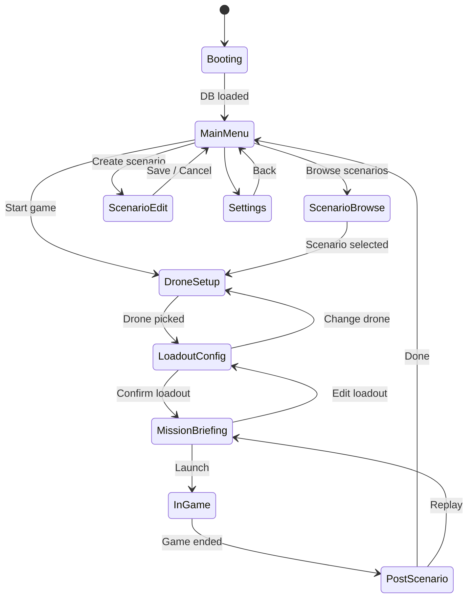
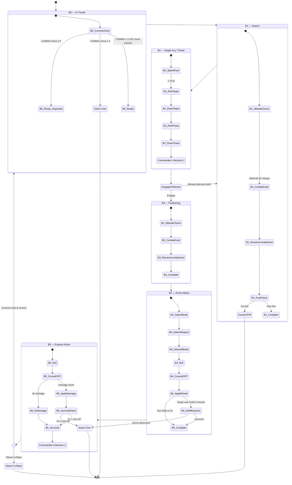

# OB3 — Drone Commander Mobile: UX Architecture

> **Agent**: OB3-UXArchitect  
> **Date**: 2026-03-10  
> **Status**: Ready for Review  
> **Handoff to**: OB3-UIDesigner (design system), OB3-SeniorDev (implementation)

---

## 1. Screen Inventory & Navigation Map

### 1.1 Screen List

| ID | Screen | Purpose | Entry Points |
|----|--------|---------|--------------|
| `S00` | **Splash / Boot** | App launch, DB init, asset loading | App cold start |
| `S01` | **Main Menu** | Hub: Quick Game, Scenarios, Settings, About | After splash, after game-end |
| `S02` | **Drone Selection** | Browse + pick one of 28 drones | Quick Game or Scenario flow |
| `S03` | **Loadout Configuration** | Equip weapons/kits on hardpoints | After drone selected |
| `S04` | **Mission Briefing** | Scenario context, objectives, confirm launch | After loadout confirmed |
| `S05` | **Game Board** | Main gameplay — B0→B5 loop | After mission briefing |
| `S06` | **Post-Scenario Briefing** | Results, VP tally, damage summary | After RTB / destroyed / targets exhausted |
| `S07` | **Scenario Browser** | Browse & select from DB scenarios | Main Menu → Scenarios |
| `S08` | **Scenario Editor** | Create custom scenarios (survey-style) | Main Menu → Editor |
| `S09` | **Settings** | Theme toggle, sound, difficulty options | Main Menu → Settings |
| `S10` | **About / Credits** | Version, credits, rulebook reference | Main Menu → About |

### 1.2 Navigation Flow



### 1.3 Navigation Rules

1. **No deep-linking** within the game loop — once in `S05` (Game Board), navigation is purely state-driven
2. **Back navigation** is allowed from `S02 → S01`, `S03 → S02`, `S04 → S03` but **not** from `S05` (must RTB or be destroyed)
3. **Settings** is accessible from Main Menu only (not mid-game in v1.0)
4. **Replay** from Post-Scenario Briefing re-enters `S04` with same drone/loadout

---

## 2. Game State Machine

### 2.1 Top-Level App States



### 2.2 In-Game State Machine (Core Game Loop)

This is the critical state machine that drives `S05 — Game Board`.



### 2.3 State Data Model

Every state in the game loop reads from and writes to a single authoritative `GameState` object:

```
GameState
├── currentBox: enum (B0, B1, B2, B3, B4, B5)
├── cycleCount: int
├── drone: DroneState
│   ├── droneId: int
│   ├── droneName: String
│   ├── droneClass: enum (A, B, C, D)
│   ├── maxAltitudes: List<Altitude>
│   ├── altitude: enum (VLOW, LOW, MEDIUM, HIGH)
│   ├── fuel: int
│   ├── structuralIntegrity: int
│   ├── maxStructuralIntegrity: int
│   ├── sensorsDamage: int (max 9)
│   ├── commsDamage: int (max 5)
│   ├── visRcs: int
│   └── capabilities: DroneCapabilities
│       ├── hasAeasa: bool
│       ├── hasSatcom: bool
│       ├── hasCommsRedundancy: bool
│       └── hasAutonomousAI: bool
├── loadout: List<LoadoutSlot>
│   ├── weaponName: String
│   ├── weaponType: String
│   ├── quantity: int
│   ├── remainingQty: int
│   ├── fireRange: String
│   ├── fireAltitude: List<Altitude>
│   └── drmByTarget: Map<TargetType, int>
├── currentTarget: TargetCard?
├── currentThreat: ThreatCard?
├── currentCombatCard: CombatCard?
├── attackMode: enum (STANDOFF, CLOSE_IN, FO_LAZE)?
├── decks: DeckState
│   ├── targetDeck: List<TargetCard>
│   ├── targetDiscard: List<TargetCard>
│   ├── targetDestroyed: List<TargetCard>
│   ├── threatDeck: List<ThreatCard>
│   ├── threatDiscard: List<ThreatCard>
│   ├── combatDeck: List<CombatCard>
│   └── combatDiscard: List<CombatCard>
├── score: int (sum of destroyed target VP)
├── actionLog: List<LogEntry>
├── commsCheckPenalty: int (0 or -1, resets each cycle)
└── gameEndReason: enum? (DESTROYED, UNCONTROLLABLE, NO_FUEL, TARGETS_EXHAUSTED, VOLUNTARY_RTB, OBJECTIVES_COMPLETE)
```

### 2.4 Allowed Transitions Table

| From | To | Trigger | Side Effects |
|------|----|---------|--------------|
| `B0` | `B1` | COMMS check passed | Set commsCheckPenalty if degraded |
| `B0` | `GAME_OVER` | COMMS check ≥ 6 | gameEndReason = UNCONTROLLABLE |
| `B1` | `B2` | Combat card resolved, fuel > 0 | Altitude may change (-1F) |
| `B1` | `FORCED_RTB` | fuel = 0 after combat card | gameEndReason = NO_FUEL |
| `B2` | `B1` | Player retreats | Discard target + threat cards |
| `B2` | `B3` | Player engages | Keep target + threat for B4/B5 |
| `B2` | `TARGETS_EXHAUSTED` | No target cards left | gameEndReason = TARGETS_EXHAUSTED |
| `B3` | `B4` | Combat card resolved | Altitude may change (-1F) |
| `B4` | `B5` | Attack resolved | Apply hit/miss, fuel cost, weapon consumed |
| `B4` | `GAME_OVER` | SAM reaction destroys drone | gameEndReason = DESTROYED |
| `B5` | `B0` | Player continues, has fuel + ammo | cycleCount++, apply fuel/damage |
| `B5` | `RTB` | Player chooses RTB | gameEndReason = VOLUNTARY_RTB |
| `B5` | `GAME_OVER` | Evasion damage ≥ max DP | gameEndReason = DESTROYED |

---

## 3. Screen-by-Screen Specifications

### S00 — Splash / Boot

| Property | Value |
|----------|-------|
| Duration | 2–3 seconds (or until DB loaded) |
| Content | App logo, version number, loading indicator |
| Auto-transition | → `S01` Main Menu |
| Error state | If DB fails: show error overlay with retry button |

---

### S01 — Main Menu

| Property | Value |
|----------|-------|
| Layout | Centered vertical list of action buttons |
| Actions | Quick Game, Scenarios, (Scenario Editor), Settings, About |
| Background | Dark theme, subtle military grid or radar animation |

**Buttons:**

| Button | Target | Notes |
|--------|--------|-------|
| ▶ Quick Game | `S02` | Start with default scenario |
| 📋 Scenarios | `S07` | Browse DB scenarios |
| ⚙ Settings | `S09` | Theme, sound |
| ℹ About | `S10` | Credits, version |

---

### S02 — Drone Selection

| Property | Value |
|----------|-------|
| Layout | Scrollable grid/list of drone cards |
| Filtering | By class (A/B/C/D), by country |
| Card preview | Name, country flag, class badge, altitude range, description excerpt |
| Action | Tap → confirm → `S03` |

**Drone Card Contents:**
- Drone name + country
- Class badge (A/B/C/D) with color coding
- Altitude range (e.g., "LOW–HIGH")
- Capability icons (AEASA, SATCOM, Comms Redundancy, Autonomous AI)
- Fuel rating (endurance hours — once DB column added)

---

### S03 — Loadout Configuration

| Property | Value |
|----------|-------|
| Layout | Selected drone info top; hardpoints/stations below |
| Interaction | Tap station → select weapon from compatible list |
| Constraints | Enforce class restrictions `(*A)` through `(*D)`, `(%)` exclusivity, `(+)` fuel penalty |
| Confirm | "Ready for Launch" button → `S04` |
| Back | ← return to `S02` (change drone) |

**Weapon Selector:**
- Show weapon name, type, compatible targets, fire range, fire altitude
- Grey out incompatible weapons
- Show DRM modifiers per target type
- Running tally of total loadout weight vs. station limits

**Validation Rules (before confirm):**
1. At least one weapon OR one kit selected
2. All `(%)` exclusivity rules satisfied
3. Weapon quantities do not exceed availability

---

### S04 — Mission Briefing

| Property | Value |
|----------|-------|
| Layout | Split: scenario info top, drone+loadout summary bottom |
| Content | Scenario name, description, narrative, primary objective, scoring mode |
| Zone info | If scenario has zones: show zone number, terrain description |
| Confirm | "Launch Mission" → `S05` |
| Back | ← return to `S03` |

---

### S05 — Game Board (Primary Game Screen)

This is the most complex screen. It must communicate the full game state at a glance while guiding the player through the B0–B5 loop.

#### 5.1 Layout Zones

```
┌─────────────────────────────┐
│  TOP BAR                    │  ← Drone name, cycle#, score
├─────────────────────────────┤
│  STATUS STRIP               │  ← Fuel bar, SI bar, Sensors, 
│                             │     COMMS, VIS/RCS, Altitude
├─────────────────────────────┤
│                             │
│  MAIN ACTION AREA           │  ← Cards, dice, decisions
│  (varies by current box)    │     (scrollable vertically)
│                             │
├─────────────────────────────┤
│  BOX PROGRESS INDICATOR     │  ← B0 ● B1 ● B2 ● B3 ● B4 ● B5
├─────────────────────────────┤
│  ACTION LOG (last 3 lines)  │  ← Scrollable log overlay
└─────────────────────────────┘
```

#### 5.2 Top Bar
- **Left**: Drone name + class badge
- **Center**: Cycle counter ("Cycle 3")
- **Right**: VP score

#### 5.3 Status Strip

Six indicators in a horizontal strip:

| Indicator | Display | Behavior |
|-----------|---------|----------|
| **Fuel** | Color bar (green→yellow→red gradient) | Width decreases as fuel burns |
| **Structural Integrity** | Numeric + bar (damage / max) | Red pulse when damaged |
| **Sensors** | Numeric + icon (0–9 scale) | Amber when degraded |
| **COMMS** | Numeric + icon (0–5 scale) | Warning icon when > 2 |
| **VIS/RCS** | Numeric + icon | Higher = more visible, danger indicator |
| **Altitude** | Text badge: VLOW / LOW / MED / HIGH | Tappable to change in B1/B3 |

#### 5.4 Box Progress Indicator

A horizontal stepper showing `B0 → B1 → B2 → B3 → B4 → B5`. The current box is highlighted. Completed boxes are dimmed. Uses color coding:

| Box | Color | Icon |
|-----|-------|------|
| B0 | Cyan | 📡 |
| B1 | Blue | 🔍 |
| B2 | Purple | 🎯 |
| B3 | Pink | 📐 |
| B4 | Red | 💥 |
| B5 | Orange | 🛡️ |

#### 5.5 Main Action Area (by box state)

##### B0 — In Transit
- If cycle > 1 and COMMS damage > 2: show COMMS Check animation (dice roll, outcome)
- Otherwise: auto-transition animation to B1

##### B1 — Search
- **Altitude choice**: Show altitude selector (only altitudes drone supports). Highlight cost: "-1F per change"
- **Combat card**: Animate card draw → flip → show card face with instructions
- **Resolve**: If event: show event description + "Apply" button. If "No Event": show "Continue" button
- **Auto**: Check fuel → if 0, show "FORCED RTB" overlay

##### B2 — Target Acquisition / Threat Determination
- **Fuel**: Deduct 1F (show animation)
- **Target roll**: Show 2D10 dice rolling → result → table lookup → draw target card
- **Threat roll**: Show 2D10 dice rolling → result → table lookup → draw threat card
- **Cards displayed**: Target card (left) and Threat card (right) shown side-by-side
- **Decision UI**:
  - Large decision panel with two buttons:
    - ✅ **"ENGAGE"** → proceed to B3
    - ❌ **"RETREAT"** → discard both, return to B1
  - Show target VP and threat severity to help the player decide

##### B3 — Positioning
- **Altitude choice**: Same selector as B1
- **Combat card**: Same draw/resolve flow as B1

##### B4 — Drone Attack
- **Step 1**: Attack mode selector — three large buttons: Stand-Off / Close-In / FO-Laze
  - Disable modes that are incompatible with current loadout
- **Step 2**: Weapon selector — list of remaining weapons, greyed if incompatible with target type
- **Step 3**: Attack altitude selector — only altitudes the drone + weapon support
- **Step 4**: Dice roll animation (1D6 + DRM breakdown shown)
- **Step 5**: CRT result displayed (HIT or MISS) with fuel cost
  - HIT: target card slides to "Destroyed" pile, VP added
  - MISS: target card slides to "Discard" pile
- **Step 5b**: If target was SAM and missed → SAM Reaction sequence
  - Roll 1D6 + VIS → if ≥ 6, SAM fires → consult SAM CRT → apply damage

##### B5 — Evasive Action
- **Roll**: 1D6 + DRM breakdown
- **CRT result**: Display damage (if any) + fuel cost
- **Damage cascade**: If damaged, animate cascade (SI → Sensors → COMMS → VIS)
- **Survival check**: If SI ≥ max DP → "DRONE DESTROYED" overlay
- **Decision UI** (if survived):
  - 🔄 **"CONTINUE"** → back to B0 (enabled only if fuel > 0 and ammo > 0)
  - 🏠 **"RETURN TO BASE"** → proceed to Post-Scenario Briefing

#### 5.6 Action Log
- Bottom overlay showing last 3 log lines
- Scrollable for full history
- Entries formatted: `[B2] Target acquired: T-72 Tank (VP: 4)`
- Text box with subtle border, monospaced for readability

---

### S06 — Post-Scenario Briefing

| Property | Value |
|----------|-------|
| Layout | Full-screen results card |
| Content sections | 1) Mission outcome header, 2) Stats, 3) Actions |

**Sections:**

1. **Outcome Header**: "MISSION COMPLETE" / "DRONE DESTROYED" / "FORCED RTB" with appropriate color (green/red/amber)
2. **Statistics Table**:
   - Cycles completed
   - Targets destroyed (list with names + VP)
   - Total VP
   - Damage taken (SI, Sensors, COMMS)
   - Fuel remaining
   - Weapons remaining
3. **Actions**: "Return to Menu" / "Replay Mission"

---

### S07 — Scenario Browser

| Property | Value |
|----------|-------|
| Layout | Scrollable list of scenario cards |
| Card content | Name, description excerpt, campaign (if any), assigned drone |
| Filter | By campaign name |
| Action | Tap → `S02` (with scenario pre-loaded) |

---

### S08 — Scenario Editor

| Property | Value |
|----------|-------|
| Layout | Multi-step survey/wizard form |
| Steps | 1) Setting, 2) Mission, 3) Decks, 4) Drone + Loadout, 5) Review |

> [!IMPORTANT]
> Per the user's answer to Q6, this should be a **multiple-choice survey form** designed by OB3-ProjectManager.
> The UX Architect provides the screen flow — content design is a BA/PM deliverable.

---

### S09 — Settings

| Property | Value |
|----------|-------|
| Content | Theme toggle (MILSTD dark / Standard), sound on/off |
| Theme | Persisted to local storage |

---

### S10 — About / Credits

| Property | Value |
|----------|-------|
| Content | Version, game designer credit, graphics credit, app developer credit |

---

## 4. Design Token Foundation (Flutter/Dart)

### 4.1 Color Palette

```dart
/// Core design tokens — MILSTD dark military theme
class OB3Colors {
  // Background hierarchy
  static const bgPrimary    = Color(0xFF0A0E17);  // Deep navy-black
  static const bgSecondary  = Color(0xFF111827);  // Panel background
  static const bgTertiary   = Color(0xFF1E293B);  // Card / elevated surface
  static const bgOverlay    = Color(0xCC000000);  // Modal overlay (80% black)

  // Text hierarchy
  static const textPrimary   = Color(0xFFE2E8F0);  // Primary text
  static const textSecondary = Color(0xFF94A3B8);  // Secondary / muted
  static const textDisabled  = Color(0xFF475569);  // Disabled state

  // Accent colors (functional)
  static const accentCyan    = Color(0xFF06B6D4);  // Active/info
  static const accentGreen   = Color(0xFF10B981);  // Success / fuel-good
  static const accentAmber   = Color(0xFFF59E0B);  // Warning / decisions
  static const accentRed     = Color(0xFFEF4444);  // Danger / damage
  static const accentPurple  = Color(0xFF8B5CF6);  // Scoring / special
  static const accentPink    = Color(0xFFEC4899);  // Positioning (B3)
  static const accentOrange  = Color(0xFFF97316);  // Evasion (B5)
  static const accentBlue    = Color(0xFF3B82F6);  // Search (B1)

  // Box-specific colors (for progress indicator & headers)
  static const boxB0 = accentCyan;
  static const boxB1 = accentBlue;
  static const boxB2 = accentPurple;
  static const boxB3 = accentPink;
  static const boxB4 = accentRed;
  static const boxB5 = accentOrange;

  // Fuel bar gradient stops
  static const fuelGood    = Color(0xFF10B981);  // Green
  static const fuelWarning = Color(0xFFF59E0B);  // Yellow
  static const fuelCritical = Color(0xFFEF4444); // Red

  // Card background tints
  static const targetCardBg  = Color(0xFF1A2332);
  static const threatCardBg  = Color(0xFF2A1525);
  static const combatCardBg  = Color(0xFF1A2520);

  // Border / separator
  static const border        = Color(0xFF334155);
  static const borderSubtle  = Color(0xFF1E293B);
}
```

### 4.2 Typography Scale

```dart
/// Typography tokens — military/technical feel
class OB3Typography {
  static const fontFamily = 'Inter';  // or 'JetBrains Mono' for data readouts

  // Scale based on 1.25 ratio (Major Third)
  static const displayLarge  = TextStyle(fontSize: 32, fontWeight: FontWeight.w700, height: 1.2);
  static const displayMedium = TextStyle(fontSize: 26, fontWeight: FontWeight.w700, height: 1.2);
  static const headlineLarge = TextStyle(fontSize: 22, fontWeight: FontWeight.w600, height: 1.3);
  static const headlineMedium = TextStyle(fontSize: 18, fontWeight: FontWeight.w600, height: 1.3);
  static const bodyLarge     = TextStyle(fontSize: 16, fontWeight: FontWeight.w400, height: 1.5);
  static const bodyMedium    = TextStyle(fontSize: 14, fontWeight: FontWeight.w400, height: 1.5);
  static const bodySmall     = TextStyle(fontSize: 12, fontWeight: FontWeight.w400, height: 1.4);
  static const labelLarge    = TextStyle(fontSize: 14, fontWeight: FontWeight.w600, height: 1.0, letterSpacing: 0.5);
  static const labelSmall    = TextStyle(fontSize: 11, fontWeight: FontWeight.w600, height: 1.0, letterSpacing: 1.0);
  static const mono          = TextStyle(fontSize: 13, fontWeight: FontWeight.w500, fontFamily: 'JetBrains Mono', height: 1.4);
}
```

### 4.3 Spacing System

```dart
/// 4px base grid spacing
class OB3Spacing {
  static const xs   = 4.0;   // 4px
  static const sm   = 8.0;   // 8px
  static const md   = 16.0;  // 16px
  static const lg   = 24.0;  // 24px
  static const xl   = 32.0;  // 32px
  static const xxl  = 48.0;  // 48px
  static const xxxl = 64.0;  // 64px

  // Standard paddings
  static const screenPadding = EdgeInsets.all(16.0);
  static const cardPadding   = EdgeInsets.all(12.0);
  static const sectionGap    = SizedBox(height: 24.0);
}
```

### 4.4 Border Radius & Elevation

```dart
class OB3Shapes {
  static const radiusSm  = BorderRadius.all(Radius.circular(4));
  static const radiusMd  = BorderRadius.all(Radius.circular(8));
  static const radiusLg  = BorderRadius.all(Radius.circular(12));
  static const radiusXl  = BorderRadius.all(Radius.circular(16));
  static const radiusFull = BorderRadius.all(Radius.circular(999));

  // Card elevation shadows (dark theme - subtle glows instead of shadows)
  static final cardShadow = [
    BoxShadow(color: Color(0x40000000), blurRadius: 8, offset: Offset(0, 2)),
  ];
}
```

---

## 5. Component Architecture

### 5.1 Component Hierarchy

```
App (MaterialApp)
├── SplashScreen
├── MainMenuScreen
├── DroneSelectionScreen
│   └── DroneCard (reusable)
├── LoadoutConfigScreen
│   ├── DroneInfoPanel
│   ├── StationSlot (per hardpoint)
│   └── WeaponSelector (bottom sheet)
├── MissionBriefingScreen
│   └── MissionInfoCard
├── GameBoardScreen
│   ├── TopBar
│   ├── StatusStrip
│   │   ├── FuelBar
│   │   ├── StatIndicator (SI, Sensors, COMMS, VIS)
│   │   └── AltitudeBadge
│   ├── BoxProgressIndicator
│   ├── MainActionArea
│   │   ├── CommsCheckPanel (B0)
│   │   ├── AltitudeSelector (B1, B3)
│   │   ├── CombatCardDisplay (B1, B3)
│   │   ├── TargetAcquisitionPanel (B2)
│   │   ├── ThreatDeterminationPanel (B2)
│   │   ├── EngageRetreatDecision (B2)
│   │   ├── AttackModeSelector (B4)
│   │   ├── WeaponSelector (B4)
│   │   ├── DiceRollAnimation (B2, B4, B5)
│   │   ├── CRTResultDisplay (B4, B5)
│   │   ├── DamageCascadeDisplay (B5)
│   │   └── ContinueRTBDecision (B5)
│   └── ActionLog
├── PostScenarioScreen
│   └── StatisticsTable
├── ScenarioBrowserScreen
│   └── ScenarioCard (reusable)
├── ScenarioEditorScreen
│   └── WizardStepForm (multi-step)
├── SettingsScreen
└── AboutScreen
```

### 5.2 Shared / Reusable Components

| Component | Used In | Description |
|-----------|---------|-------------|
| `DiceRollAnimation` | B2, B4, B5 | Animated dice with configurable type (D6, 2D10) |
| `CardDisplay` | B1, B2, B3, B4 | Universal card renderer (target, threat, combat) |
| `DecisionPanel` | B2, B5 | Two-button choice UI with descriptive labels |
| `AltitudeSelector` | B1, B3, B4 | Vertical toggle for VLOW/LOW/MED/HIGH |
| `StatIndicator` | StatusStrip | Numeric + icon + optional bar |
| `FuelBar` | StatusStrip | Horizontal gradient bar with color stops |
| `ActionButton` | Everywhere | Primary/secondary/danger variants |
| `GameCard` | Drone select, Scenario browse | Reusable card container with image + text |

---

## 6. Interaction Patterns

### 6.1 Game Flow Pacing

Each box transition has a deliberate pacing to prevent the game from feeling like a data dump:

| Phase | Pacing | Player Action |
|-------|--------|---------------|
| B0 → B1 | Fast (auto, 0.5s) unless COMMS check | Watch transition |
| B1 (altitude) | Wait for input | Toggle altitude or skip |
| B1 (combat card) | 1s card flip animation | Tap "Continue" or "Apply" |
| B2 (target roll) | 1.5s dice animation | Watch dice |
| B2 (threat roll) | 1.5s dice animation | Watch dice |
| B2 (decision) | **Indefinite wait** | Engage or Retreat |
| B3 | Same as B1 | Altitude + combat card |
| B4 (selections) | **Indefinite wait** (3 choices) | Mode, weapon, altitude |
| B4 (attack) | 1.5s dice + result animation | Watch outcome |
| B5 (evasion) | 1.5s dice + result animation | Watch outcome |
| B5 (decision) | **Indefinite wait** | Continue or RTB |

### 6.2 Animation Specifications

| Animation | Duration | Type |
|-----------|----------|------|
| Card flip | 600ms | 3D rotation with shadow |
| Dice roll | 1200ms | Bounce physics simulation |
| Box transition | 400ms | Slide + fade between panels |
| Damage pulse | 300ms × 3 | Red glow on status indicator |
| Fuel decrease | 500ms | Bar width + color gradient shift |
| HIT result | 800ms | Scale up + particle burst (green) |
| MISS result | 500ms | Shake + fade-out |
| VP increment | 400ms | Counter roll-up animation |
| Drone destroyed | 2000ms | Full-screen overlay with fade |

### 6.3 Dice Roll Modifier Breakdown

When dice are rolled (B2, B4, B5), show a transparent DRM breakdown panel:

```
┌─ DRM Breakdown ─────────────────┐
│  Base roll:          4          │
│  + AEASA Radar:     +10        │
│  + COMMS (0 dmg):   +10        │
│  ─────────────────────         │
│  Final DRM:          24        │
└────────────────────────────────┘
```

This is critical for player understanding and debuggability.

### 6.4 Accessibility Considerations

| Requirement | Implementation |
|-------------|----------------|
| All interactive elements | Semantic labels via `Semantics` widget |
| Dice results | Announce via `SemanticsService.announce()` |
| Color-blind safety | All status indicators use icon + numeric value, not color alone |
| Minimum touch targets | 48×48dp minimum for all buttons |
| Font scaling | Support Dynamic Type (up to 1.5x) |

---

## 7. State Management Recommendation

### Architecture Pattern: **BLoC + Freezed**

| Layer | Responsibility |
|-------|---------------|
| **UI Layer** | Stateless widgets rendering BLoC state |
| **BLoC Layer** | Game logic, box transitions, dice resolution, CRT lookups |
| **Repository Layer** | Database access (sqflite), deck management, CRT table lookups |
| **Model Layer** | Freezed immutable data classes (GameState, DroneState, Cards) |

### BLoC Organization

| BLoC | Responsibility |
|------|---------------|
| `GameBloc` | Master game loop state machine (B0–B5 transitions) |
| `DroneSelectionBloc` | Drone browsing, filtering, selection |
| `LoadoutBloc` | Weapon configuration, validation |
| `ScenarioBloc` | Scenario browsing, loading, editing |
| `SettingsBloc` | Theme, sound preferences |

### Event Flow Example (B4 Attack)

```
User selects mode → AttackModeSelected event
  → GameBloc updates state.attackMode

User selects weapon → WeaponSelected event
  → GameBloc validates weapon compatibility

User selects altitude → AttackAltitudeSelected event
  → GameBloc validates drone can operate at altitude

User taps "Fire" → ExecuteAttack event
  → GameBloc:
    1. Roll 1D6
    2. Compute DRM (base + weapon DRM + card modifiers + sensor penalty)
    3. Apply column shifts
    4. Look up Attack CRT
    5. Emit AttackResult state (HIT/MISS, fuel cost)
    6. Update: fuel, loadout, target card pile, score
    7. Check SAM reaction if applicable
    8. Transition to B5
```

---

## 8. File Structure Recommendation

```
lib/
├── main.dart
├── app.dart                       # MaterialApp, routing, theme
├── core/
│   ├── theme/
│   │   ├── ob3_colors.dart
│   │   ├── ob3_typography.dart
│   │   ├── ob3_spacing.dart
│   │   ├── ob3_shapes.dart
│   │   └── ob3_theme.dart         # ThemeData assembly
│   ├── constants/
│   │   ├── game_constants.dart    # Max values, altitude enum, etc.
│   │   └── crt_tables.dart        # Attack, Counterfire, SAM CRT data
│   └── utils/
│       ├── dice.dart              # D6 / D10 roll utilities
│       └── drm_calculator.dart    # DRM computation helpers
├── data/
│   ├── database/
│   │   ├── db_provider.dart       # sqflite initialization
│   │   └── db_constants.dart      # Table/column names
│   ├── models/                    # Freezed data classes
│   │   ├── drone.dart
│   │   ├── weapon.dart
│   │   ├── target_card.dart
│   │   ├── threat_card.dart
│   │   ├── combat_card.dart
│   │   ├── scenario.dart
│   │   ├── game_state.dart
│   │   └── loadout_slot.dart
│   └── repositories/
│       ├── drone_repository.dart
│       ├── weapon_repository.dart
│       ├── card_repository.dart
│       └── scenario_repository.dart
├── game/
│   ├── bloc/
│   │   ├── game_bloc.dart
│   │   ├── game_event.dart
│   │   └── game_state.dart        # BLoC state (not to confuse with model)
│   ├── engine/
│   │   ├── game_engine.dart       # Pure logic: CRT lookups, damage cascade
│   │   ├── deck_manager.dart      # Shuffle, draw, discard, reshuffle
│   │   └── damage_calculator.dart # SI → Sensors → COMMS → VIS cascade
│   └── widgets/                   # Game-screen-only widgets
│       ├── status_strip.dart
│       ├── fuel_bar.dart
│       ├── box_progress_indicator.dart
│       ├── dice_roll_animation.dart
│       ├── card_display.dart
│       ├── decision_panel.dart
│       ├── altitude_selector.dart
│       ├── attack_mode_selector.dart
│       ├── weapon_selector.dart
│       ├── drm_breakdown.dart
│       ├── damage_cascade_display.dart
│       └── action_log.dart
├── screens/
│   ├── splash_screen.dart
│   ├── main_menu_screen.dart
│   ├── drone_selection_screen.dart
│   ├── loadout_config_screen.dart
│   ├── mission_briefing_screen.dart
│   ├── game_board_screen.dart
│   ├── post_scenario_screen.dart
│   ├── scenario_browser_screen.dart
│   ├── scenario_editor_screen.dart
│   ├── settings_screen.dart
│   └── about_screen.dart
└── shared/
    └── widgets/
        ├── action_button.dart
        ├── game_card.dart
        ├── stat_indicator.dart
        └── section_header.dart
```

---

## 9. Router / Navigation

### Recommended: `go_router`

```dart
final router = GoRouter(
  initialLocation: '/splash',
  routes: [
    GoRoute(path: '/splash',    builder: (_, __) => SplashScreen()),
    GoRoute(path: '/menu',      builder: (_, __) => MainMenuScreen()),
    GoRoute(path: '/drones',    builder: (_, __) => DroneSelectionScreen()),
    GoRoute(path: '/loadout',   builder: (_, __) => LoadoutConfigScreen()),
    GoRoute(path: '/briefing',  builder: (_, __) => MissionBriefingScreen()),
    GoRoute(path: '/game',      builder: (_, __) => GameBoardScreen()),
    GoRoute(path: '/debrief',   builder: (_, __) => PostScenarioScreen()),
    GoRoute(path: '/scenarios', builder: (_, __) => ScenarioBrowserScreen()),
    GoRoute(path: '/editor',    builder: (_, __) => ScenarioEditorScreen()),
    GoRoute(path: '/settings',  builder: (_, __) => SettingsScreen()),
    GoRoute(path: '/about',     builder: (_, __) => AboutScreen()),
  ],
);
```

**Route Guards:**
- `/game` cannot be accessed without a valid `GameState` in the BLoC
- `/loadout` requires a selected drone ID
- Back navigation from `/game` is disabled (must use in-game RTB)

---

## 10. Key Design Decisions & Rationale

| Decision | Choice | Rationale |
|----------|--------|-----------|
| Single `GameBoardScreen` | One screen, content driven by box state | Avoids jarring screen transitions mid-gameplay |
| BLoC over Riverpod | BLoC with `Freezed` | State machine pattern maps naturally to BLoC events; clear unidirectional flow |
| Fuel as color bar | No numeric display | Per user requirement — communicates urgency intuitively |
| Dice as physics animation | Not just random numbers | Board-game feel; player satisfaction from "rolling" |
| DRM breakdown always visible | Transparent modifier panel | Prevents player frustration ("why did I miss?") |
| 4 altitude levels (VLOW) | Extended from rulebook's 3 | Per Q9 answer; CRT tables must be extended accordingly |

> [!WARNING]
> **BLOCKED**: The VLOW altitude row does NOT exist in the current rulebook CRT tables. The game designer must provide VLOW values for Attack CRT, Counterfire CRT, and SAM CRT before the engine can be fully implemented. This is tracked in the DILEK Clearance List.

---

## 11. Open Dependencies

| Dependency | Owner | Status |
|------------|-------|--------|
| VLOW CRT table rows | Game Designer / DILEK | ⬜ OPEN |
| Counterfire LOW row corrections | Game Designer / DILEK | ⬜ OPEN |
| SAM Counterfire LOW row corrections | Game Designer / DILEK | ⬜ OPEN |
| `endurance_hours` column in `drones` table | OB3-SeniorDev / DB migration | ⬜ OPEN |
| Scenario Editor survey form design | OB3-ProjectManager | ⬜ OPEN |
| Design system visual polish | OB3-UIDesigner | ⬜ PENDING (this doc is input) |

---

**ArchitectUX Agent**: OB3-UXArchitect  
**Foundation Date**: 2026-03-10  
**Developer Handoff**: Ready for OB3-UIDesigner (design system) and OB3-SeniorDev (implementation)  
**Next Steps**: UI Designer creates visual assets and component mockups; Senior Dev scaffolds Flutter project using this architecture
